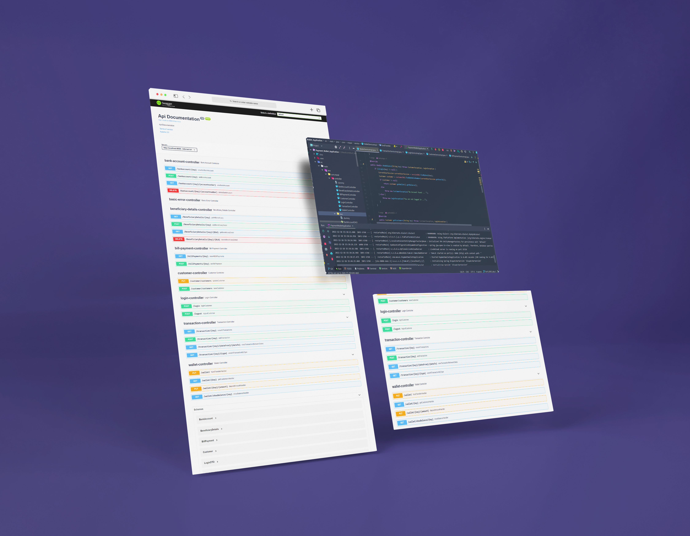
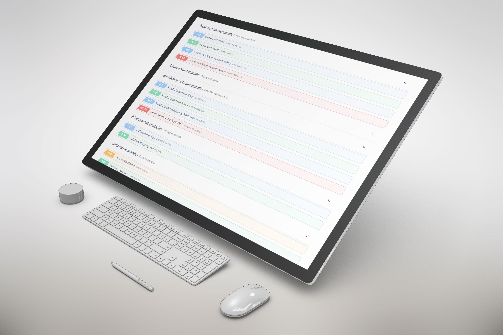
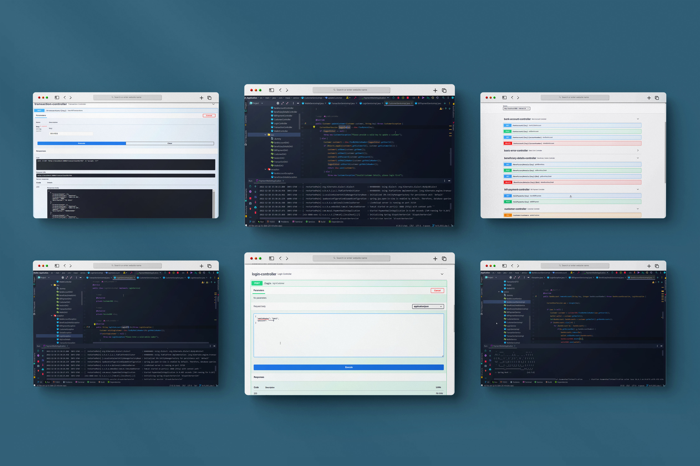
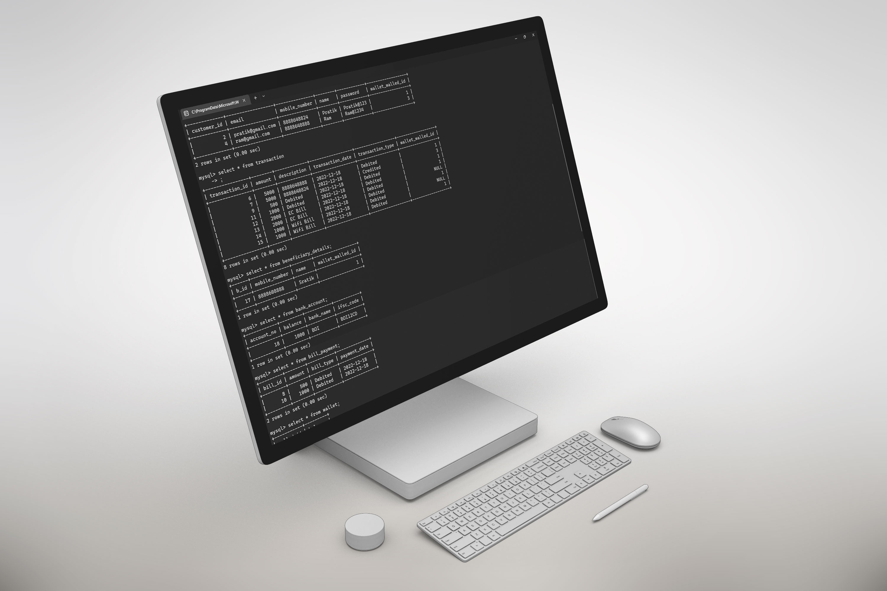

# Payment Wallet Application API

To create payment wallet application for XYZ bank. Customers will be able to add their money in the wallet. Customer should be able to pay different bills using this wallet. They should be able to connect bank account with this payment wallet and add money. Application should allow customers to check the balance, deposit money etc.

## Deployed link of project
- <a href="#"> Payment Wallet Application </a>

## Team Members

<ul>
  <li><a href="https://github.com/pratiksontakke">Pratik Sontakke</a></li>
  <li><a href="https://github.com/Hartumpa">Harshit Awasthi</a></li>
  <li><a href="https://github.com/jkka777">Kishore J</a></li>
  <li><a href="https://github.com/sachin9603">Sachin Parmar</a></li>
  <li><a href="https://github.com/rajashekharms369">Rajashekhar Sambalad</a></li>

</ul>


## Language
- Java

## Database
- My-SQL

## Deployment

On terminal perform:
```bash
  Open pom.xml with Spring Tool Suite / IntelliJ IDEA and run
```

On Swagger :

```bash
  http://localhost:8888/swagger-ui/#/
```

application.properties : 
```bash
  #changing the server port
  server.port=8888
  #db specific properties
  spring.datasource.url=jdbc:mysql://localhost:3306/projectapi
  spring.datasource.driver-class-name=com.mysql.cj.jdbc.Driver
  spring.datasource.username=Enter your My-SQL Username
  spring.datasource.password=Enter your My-SQL Password
  #ORM s/w specific properties
  spring.jpa.hibernate.ddl-auto=update
  spring.jpa.show-sql=true

  spring.mvc.pathmatch.matching-strategy = ANT_PATH_MATCHER

```


## Spring Boot Dependencies
- spring-boot-starter-data-jpa
- spring-boot-starter-validation
- spring-boot-starter-web
- spring-boot-devtools
- mysql-connector-j
- lombok
- springfox-boot-starter
- spring-boot-maven-plugin

## 🛠 Tech Stack

- Java
- Spring
- Spring-boot
- Spring-boot-web
- spring-security
- My-SQL workbench 
- Hibernate

## ER Diagram


## Functionality

- Signup
- Login
- Logout
- Authentication
- Fund transfer to another account
- Deposit Amount
- Show Balance
- View all transactions
- View transactions between dates
- Add transaction
- View all transactions by type (Credited/Debited)
- View all bill payments
- Add bills
- Add Benificiary
- Get all beneficiaries
- Get beneficiary detail by beneficiary id
- Delete beneficiary by beneficiary id
- Add bank account
- View all bank accounts
- View bank account by account number
- Delete bank account by account number
- Real time My-SQL Database


## Flow of User

- Signup 
- Login 
- Authentication 
- Wallet 
- Bank accounts 
- Beneficiary 
- Transactions 
- Logout 

#### API Documentation :








## Thank you note
Thank you all who is giving precious time to visit our little creative project which is made with lot of efforts.

_<p align="center"><sub>- Readme file designed by <a href="https://github.com/pratiksontakke">Pratik Sontakke</a> -</sub></p>_
